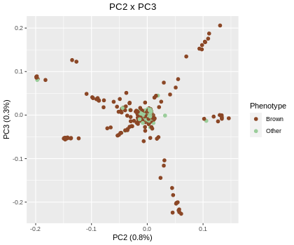

# GWAS_Ole
GWAS of eye color

```r
library(dplyr)
library(ggplot2)
library(qqman)
library(SNPRelate)
library(gridExtra)
```
Making a binary phenotype file (brown vs other).

```r
nonbinary = read.table('eye_color.txt', header = F)
fam = read.table('eye_color.fam')
new.levels = c(2, 1, 1, 1, 1, 1, 2, 1, 2, 1, 1, 2)
FID = fam$V1
IID = nonbinary[,1]
phenotype = new.levels[factor(nonbinary$V2)]
write.table(data.frame(FID, IID, phenotype), file = 'binary_phenotype.txt', col.names = T, row.names = F, quote = F)
```

## Quality Control
#### Missing data

Testing for missing data

```bash 
plink --allow-no-sex --bfile eye_color --missing --out eye_color
```

This creates the files eye_color.imiss and eye_color.lmiss 

To analyse the heterozygosity of the sample --het is used

```bash
plink --allow-no-sex --bfile eye_color --het --out eye_color
```

The .het output contains the observed number of homozygous genotypes as well as the number of non-missing genotypes per individual, which can be used to calculate the heterozygosity rate per individual - which is given by this formula:


Plotting this value with the proportion of SNPs per individual and two red lines are added that mark the borders of the 3 standard deviations from the mean (our cut-off).

```r
imiss = read.table('eye_color.imiss', header = T, sep="")
het = read.table('eye_color.het', header = T, sep="")

het$obs_het = (het$N.NM. - het$O.HOM.)/het$N.NM.
mean_het = mean(het$obs_het)
sd_het = sd(het$obs_het)

ggplot(data = het, aes(x = obs_het, y = imiss$F_MISS)) +
 geom_point(color='royalblue4', size=2, alpha=0.5) +
 labs(y = "Proportion of missing SNPs per individual", x = "Observed heterozygosity rate per individu
al") +
 geom_vline(xintercept = mean_het + 3*sd_het, color = "red") +
 geom_vline(xintercept = mean_het - 3*sd_het, color = "red") +
 theme_bw() +
 labs(title = "Heterozygosity rate versus proportion of missing SNPs") +
 theme(plot.title = element_text(hjust = 0.5))
```


The samples that are outside these lines are added to a file.

```r
right = mean_het + 3*sd(het$obs_het)
left = mean_het - 3*sd(het$obs_het)
filtering = cbind(imiss, het)
outlier_ind = subset(filtering, filtering$obs_het > right | filtering$obs_het < left)
write.table(outlier_ind[,c(1,2)], 'missing_values.txt', col.names = FALSE, row.names = FALSE)
```

And then they are filtered out.

```bash
plink --allow-no-sex --bfile eye_color --remove wrong_het_missing_values.txt --pheno binary_phenotype.txt --make-bed --out eye_color_het
```
13 individuals were filtered out and 1274 were left.

#### Relatedness

Using an IBD matrix any related individuals are now filtered away. 

```bash
plink --allow-no-sex --bfile eye_color_het --indep-pairwise 500kb 5 0.2 --out eye_color_het
plink --allow-no-sex --bfile eye_color_het --extract eye_color_het.prune.in --genome --min 0.185 --out eye_color_het
```
Any individual with an IBD larger than 0.185 is removed.

```r
ibd = read.table('eye_color_het.genome', header = TRUE)
members = ibd[,1]
members = unique(members)
write.table(cbind(members,members), file = 'wrong_ibd.txt', col.names = F, row.names = F)
```

```bash
plink --allow-no-sex --bfile eye_color_het --remove wrong_ibd.txt --make-bed --out eye_color_het_ibd
```
1260 people are left in the data.

#### Variant filtering

Recomputing the missing data for each variant.

```bash
plink --allow-no-sex --bfile eye_color_het_ibd --missing --out eye_color_het_ibd
```

With the phenotype file, the Fisher’s exact test is performed.

```bash
plink --allow-no-sex --bfile eye_color_het_ibd --pheno binary_phenotype.txt --test-missing --out eye_color_het_ibd
```

```r
test_missing = read.table('eye_color_het_ibd.missing', header = TRUE)
fail_diffmiss_qc = test_missing[test_missing$P < 10e-5, 2]
write.table(fail_diffmiss_qc, file = 'fail-diffmiss-qc.txt', row.names = F, col.names = F)
```

These variants are then filtered out. Furthermore, any variant with a missing genotype rate larger than 0.5, a too large deviation from Hardy-Weinberg equilibrium or has a MAF (minor allele frequency) of less than 0.01. 

```bash
plink --allow-no-sex --bfile eye_color_het_ibd --exclude fail-diffmiss-qc.txt --pheno binary_phenotype.txt --geno 0.5 --hwe 0.00001 --maf 0.01 --make-bed --out eye_color_het_ibd_var
```
This leaves 783902 variants.

### Principal Component Analysis

Pruning the data for PCA

```bash
plink --allow-no-sex --bfile eye_color_het_ibd_var --indep-pairwise 500kb 5 0.2 --out eye_color_het_ibd_var
plink --allow-no-sex --bfile eye_color_het_ibd_var --pheno binary_phenotype.txt --extract eye_color_het_ibd_var.prune.in --pca 50 --out eye_color_het_ibd_var
```

Using SNPRelate to perform PCA on the pruned data.

```r
snpgdsBED2GDS("eye_color_het_ibd_var.bed","eye_color_het_ibd_var.fam","eye_color_het_ibd_var.bim", "eye_color.gds")

n_pcs <- min(1260, 783902)

genofile <- snpgdsOpen("eye_color.gds",  FALSE, TRUE, TRUE)
pca <- snpgdsPCA(genofile,eigen.cnt=n_pcs)
summary(pca)

eigenvectors <- as.data.frame(pca$eigenvect)
colnames(eigenvectors) <- as.vector(sprintf("PC%s", seq(1:nrow(pca$eigenvect))))
pca$sample.id <- sub("_eye_color_het_ibd_var_piece_dedup", "", pca$sample.id)
pca_percent <- pca$varprop*100

simpler.levels = c("Brown", "Other", "Other", "Other", "Other", "Other", "Brown", "Other", "Brown", "Other
", "Other", "Brown")

write.table(data.frame(FID, IID, eye_color = simpler.levels[factor(nonbinary$V2)]), file = 'simpler_eye_color.txt', col.names = T, row.names = F, quote = F)
info <- read.table("simpler_eye_color.txt", header = T)
eigenvectors$Phenotype <- info[match(pca$sample.id, info$IID),]$eye_color 

PC1_var <- pca$varprop[1]*100
PC2_var <- pca$varprop[2]*100

ggplot(data = eigenvectors, aes(x = PC1, y = PC2, col = Phenotype)) +
 geom_point(size=2,alpha=0.5) +
 scale_color_manual(breaks = c("Brown", "Other"), values=c("brown", "blue")) +
 xlab("PC1 (1.5%)") + ylab("PC2 (0.8%)") +
 labs(title = "PC1 x PC2") +
 theme(plot.title = element_text(hjust = 0.5))

ggplot(data = eigenvectors, aes(x = PC2, y = PC3, col = Phenotype)) +
    geom_point(size=2,alpha=0.5) +
    scale_color_manual(breaks = c("Brown", "Other"), values=c("brown", "blue")) +
    xlab("PC2 (0.8%)") + ylab("PC3 (0.3%)") +
    labs(title = "PC2 x PC3") +
    theme(plot.title = element_text(hjust = 0.5))
```

 


## Test For Association

Fisher's exact test

```bash
plink --allow-no-sex --bfile eye_color_het_ibd_var --pheno binary_phenotype.txt --fisher --out eye_color_het_ibd_var_brown
```

P-values plotted in Manhattan and QQ plot with Bonferroni corrected significance level.

```r
association_test = read.table("eye_color_het_ibd_var_brown.assoc.fisher", header = T)
corrected_level <- 0.05/length(association_test$SNP)
manhattan(association_test, suggestiveline = FALSE, main = "Manhattan Plot", genomewideline = -log10(corrected_level), annotatePval = corrected_level)
```


#### Genomic control

```r
r <- gcontrol2(association_test$P, col="black")
```


Using the inflation factor lambda to correct the p-values.

```r
inflationfactor <- r$lambda # 

association_test$GC  <- association_test$P/inflationfactor

gcontrol2(association_test$GC, col="black", main = "Corrected QQ plot")

manhattan(association_test, p = "GC", suggestiveline = FALSE, main = "Manhattan Plot with genomic control", genomewideline = -log10(corrected_level), annotatePval = corrected_level)
```

 

#### PC adjusting

First done for the first 20 PCs, but several were tested.

```bash
plink --allow-no-sex --bfile eye_color_het_ibd_var --pheno binary_phenotype.txt --logistic --covar eye_color_het_ibd_var.eigenvec --covar-number 1-20 --out eye_color_het_ibd_var_brown_20
```

QQplot and Manhattanplot

```r
log_regres_20 <- read.table("eye_color_het_ibd_var_brown_20.assoc.logistic", header = T)
only_snp_20 <- na.omit(subset(log_regres_20, TEST=="ADD"))
manhattan(only_snp_20, suggestiveline = FALSE, main = "Manhattan Plot", genomewideline = -log10(0.05/length(only_snp_20$SNP)), annotatePval = 0.05/length(only_snp_20$SNP))

cov_20 <- gcontrol2(only_snp_20$P, col="black", main = "QQ plot")

cov_20$lambda # 1.01642984555232

log_regres_10 <- read.table("eye_color_het_ibd_var_brown_10.assoc.logistic", header = T)
only_snp_10 <- na.omit(subset(log_regres_10, TEST=="ADD"))
manhattan(only_snp_10, suggestiveline = FALSE, main = "Manhattan Plot", genomewideline = -log10(0.05/length(only_snp_10$SNP)), annotatePval = 0.05/length(only_snp_10$SNP))

cov_10 <- gcontrol2(only_snp_10$P, col="black", main = "QQ plot")

cov_10$lambda # 1.00842669895273

log_regres_30 <- read.table("eye_color_het_ibd_var_brown_30.assoc.logistic", header = T)
only_snp_30 <- na.omit(subset(log_regres_30, TEST=="ADD"))
manhattan(only_snp_30, suggestiveline = FALSE, main = "Manhattan Plot", genomewideline = -log10(0.05/length(only_snp_30$SNP)), annotatePval = 0.05/length(only_snp_30$SNP))

cov_30 <- gcontrol2(only_snp_30$P, col="black", main = "QQ plot")

cov_30$lambda # 1.02352992251882
```

 

These are the plots for 10 PCs since this seemed best as lambda was closest to 1 for the different PCs tested. 5, 15, 40 were also not better than 10.

## Most Significant SNP, 30 kb around it

```bash
plink --allow-no-sex --bfile eye_color_het_ibd_var --pheno binary_phenotype.txt --recode A --snp rs1129038 --window 30 --out eye_color_het_ibd_var_brown
```

Genotype distributions

```r
d <- read.table("eye_color_het_ibd_var_brown.raw", header = T)
d <- d %>% mutate(pheno = ifelse(PHENOTYPE == 2, "Brown", "Other"))

snp0 <- d %>% filter(d$rs1129038_C == 0)
snp1 <- d %>% filter(d$rs1129038_C == 1)
snp2 <- d %>% filter(d$rs1129038_C == 2)

l <- ggplot(snp0, aes(x = pheno, fill = pheno)) +
 geom_bar(fill = c('sienna4', 'darkseagreen3')) +
 theme(axis.title.x = element_blank(), plot.title = element_text(hjust = 0.5, size = 11)) + guides(fill=FALSE) + ggtitle("Homozygous")

m <- ggplot(snp1, aes(x = pheno, fill = pheno)) +
 geom_bar(fill = c('sienna4', 'darkseagreen3')) +
 theme(axis.title.x = element_blank(), plot.title = element_text(hjust = 0.5, size = 11)) + guides(fill=FALSE) + ggtitle("Heterozygous")

n <- ggplot(snp2, aes(x = pheno, fill = pheno)) +
 geom_bar(fill = c('sienna4', 'darkseagreen3')) +
 theme(axis.title.x = element_blank(), plot.title = element_text(hjust = 0.5, size = 11)) + guides(fill=FALSE) + ggtitle("Homozygous")

grid.arrange(l, m, n, ncol=3, top = "Distribution of each genotype")
```


## Epistasis Analysis

Doing an exhaustive epistasis test with the faster --fast-epistasis command.

```bash
plink --allow-no-sex --bfile eye_color_het_ibd_var --fast-epistasis --out eye_color_brown
```
Calculating the distance between each test pair and plotting the result.

```r
f <- read.table("eye_color_brown.epi.cc", header = T)

snp1 <- log_regres_10[match(f$SNP1, log_regres_10$SNP),]$BP
snp2 <- log_regres_10[match(f$SNP2, log_regres_10$SNP),]$BP
f$BP1 <- snp1
f$BP2 <- snp2
bonf <- 0.001/length(f$P)
f$Distance <- abs(snp2-snp1)

ggplot(f) +
    geom_point(aes(x = Distance, y = -log(P), col=P < bonf)) +
    scale_color_manual(values = c('black', 'darkseagreen3'))

```


Finding the 100 SNP pairs with the smallest p-values.

```r
df <- f %>% 
    arrange(P) %>%
    top_n(-100) %>% 
    select(SNP1, SNP2)
```

Making a file for another epistasis test.
```r
write.table(df, "epi.set", append = FALSE, sep = " ", dec = ".", row.names = FALSE, col.names = FALSE)
```
Running the more precise --epistasis test on these 100 pairs

```bash
plink --allow-no-sex --bfile eye_color_het_ibd_var --epistasis --set-test --set epi.set --out eye_color_top100
```
```r
top100 <- read.table("eye_color_top100.epi.cc", header = T)

snp1 <- log_regres_10[match(top100$SNP1, log_regres_10$SNP),]$BP
snp2 <- log_regres_10[match(top100$SNP2, log_regres_10$SNP),]$BP
top100$BP1 <- snp1
top100$BP2 <- snp2
bonf <- 0.001/length(top100$P)
top100$Distance <- abs(snp2-snp1)

ggplot(top100) +
    geom_point(aes(x = Distance, y = -log(P), col=P < bonf)) +
    scale_color_manual(values = c('black', 'darkseagreen3'))
   
```


```r
ggplot(top100, aes(x = SNP1, y = SNP2, fill = P)) +
    geom_tile()  +
    theme(axis.text=element_text(size=4),
          axis.text.x = element_text(angle = 90))
```


Grouping the chromosomes together, calculating the mean p-value and plotting the result.
```r
top100_chr <- top100 %>%
    group_by(CHR1, CHR2) %>% 
    summarise(chr_mean = mean(P))

ggplot(top100_chr, aes(x = CHR1, y = CHR2, fill = chr_mean)) +
    geom_tile() +
    labs(fill='Mean p-value')
```


